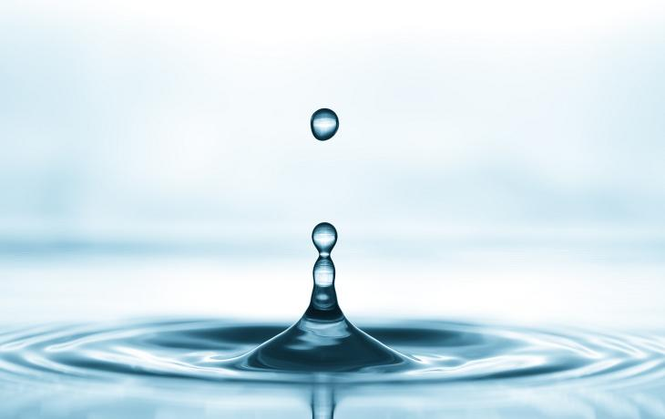

# INSTALLAZIONE

---

# forma artistica in cui `MEDIA` diversi occupano uno spazio comune

---

# costruiremo un dispositivo in grado di `SENTIRE` delle gocce d'acqua cadere su una ` SUPERFICIE `...

--

---

# ...E DI `INNESCARE` DEGLI `EVENTI` OGNI VOLTA CHE UNA GOCCIA VIENE CAPTATA

---

# GLI EVENTI SARANNO `SUONI` E `VOCI` REGISTRATE...
# ...CHE LEGGONO E RECITANO PAROLE E FRASI SUL TEMA DELL'`ACQUA` {: .fragment}

---

# 
 liquido 

## 
 bere 

### 
 limpida 

# 
 sommergere 

##### 
 potabile 

### 
 lavare 

# 
 ... 

---

# COSTRUIREMO DIVERSE `POSTAZIONI` NELLO SPAZIO

---

# OGNUNA DELLE QUALI COMPOSTA DA UN `DEFLUSSORE`
 {: .fragment}

--

# CHE PERMETTERA' ALL'ACQUA DI UNA BOTTIGLIA DI PLASTICA DI SCENDERE A `GOCCE`

---

# LE GOCCE CADRANNO SU UNA SUPERFICIE COLLEGATA A UN `MICROFONO A CONTATTO`
 {: .fragment}

---

# CHE ATTRAVERSO UNA SCHEDA `ARDUINO` INVIERA' UN SEGNALE AL COMPUTER
 {: .fragment}

---

# DOVE `PUREDATA` SI OCCUPERA' DI GESTIRE LE NOSTRE VOCI E I NOSTRI SUONI

--

---

# FLUSSO DI LAVORO

---

# Testi 
1. scelta e compilazione {: .fragment}
2. registrazione {: .fragment}
3. editing e pulizia {: .fragment}
4. sequencing {: .fragment}

---

# Arduino
1. Costruzione del dispositivo (cavi, piezo, led, *inscatolamento*) {: .fragment}
2. Scrittura del codice (Arduino IDE) {: .fragment}

---

# Suoni
1. Che suoni? (suoni d'acqua, sintesi per modelli fisici, etc...) {: .fragment}
2. Costruzione della *patch* con **puredata** {: .fragment}

---

# Parte meccanica e assemblaggio
1. Costruzione {: .fragment} 
2. Collegamento di tutte le parti {: .fragment}
3. Messa in moto! {: .fragment}